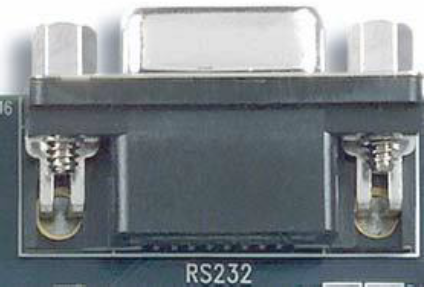

# Apresentação da Disciplina e Introdução ao Software Quartus II e ao Kit Cyclone II

## Altera Cyclone II

  

  

### Gravação

   
  Carregar arquivo no formato <code>sof</code>.

   
  Carregar arquivo no formato <code>pof</code>.

### Push Buttons

  

**Pressionado:** Nível Baixo (0V).

**Solto:** Nível Alto (3,3 V).

Possui circuito com Schmitt Trigger para *debounce*.

| Switch   | FPGA Pin  | Description     |
| -------- | --------- | --------------- |
| `KEY[0]` | `PIN_R22` | `Pushbutton[0]` |
| `KEY[1]` | `PIN_R21` | `Pushbutton[1]` |
| `KEY[2]` | `PIN_T22` | `Pushbutton[2]` |
| `KEY[3]` | `PIN_T21` | `Pushbutton[3]` |

### Toggle Switches

  

**Pressionado:** Nível Baixo (0V).

**Solto:** Nível alto (3,3 V).

| Switch  | FPGA Pin  | Description        |
| ------- | --------- | ------------------ |
| `SW[0]` | `PIN_L22` | `Toggle Switch[0]` |
| `SW[1]` | `PIN_L21` | `Toggle Switch[1]` |
| `SW[2]` | `PIN_M22` | `Toggle Switch[2]` |
| `SW[3]` | `PIN_V12` | `Toggle Switch[3]` |
| `SW[4]` | `PIN_W12` | `Toggle Switch[4]` |
| `SW[5]` | `PIN_U12` | `Toggle Switch[5]` |
| `SW[6]` | `PIN_U11` | `Toggle Switch[6]` |
| `SW[7]` | `PIN_M2`  | `Toggle Switch[7]` |
| `SW[8]` | `PIN_M1`  | `Toggle Switch[8]` |
| `SW[9]` | `PIN_L2`  | `Toggle Switch[9]` |

### LEDs

  

| Signal Name | FPGA Pin  | Description    |
| ----------- | --------- | -------------- |
| `LEDR[0]`   | `PIN_R20` | `LED Red[0]`   |
| `LEDR[1]`   | `PIN_R19` | `LED Red[1]`   |
| `LEDR[2]`   | `PIN_U19` | `LED Red[2]`   |
| `LEDR[3]`   | `PIN_Y19` | `LED Red[3]`   |
| `LEDR[4]`   | `PIN_T18` | `LED Red[4]`   |
| `LEDR[5]`   | `PIN_V19` | `LED Red[5]`   |
| `LEDR[6]`   | `PIN_Y18` | `LED Red[6]`   |
| `LEDR[7]`   | `PIN_U18` | `LED Red[7]`   |
| `LEDR[8]`   | `PIN_R18` | `LED Red[8]`   |
| `LEDR[9]`   | `PIN_R17` | `LED Red[9]`   |
| `LEDG[0]`   | `PIN_U22` | `LED Green[0]` |
| `LEDG[1]`   | `PIN_U21` | `LED Green[1]` |
| `LEDG[2]`   | `PIN_V22` | `LED Green[2]` |
| `LEDG[3]`   | `PIN_V21` | `LED Green[3]` |
| `LEDG[4]`   | `PIN_W22` | `LED Green[4]` |
| `LEDG[5]`   | `PIN_W21` | `LED Green[5]` |
| `LEDG[6]`   | `PIN_Y22` | `LED Green[6]` |
| `LEDG[7]`   | `PIN_Y21` | `LED Green[7]` |

### Display de 7 segmentos

  

**Aceso:** Nível Baixo (0V).

**Apagado:** Nível Alto (3,3 V).

| Signal Name | FPGA Pin | Description                  |
| ----------- | -------- | ---------------------------- |
| `HEX0[0]`   | `PIN_J2` | `Seven-Segment segment 0[0]` |
| `HEX0[1]`   | `PIN_J1` | `Seven-Segment segment 0[1]` |
| `HEX0[2]`   | `PIN_H2` | `Seven-Segment segment 0[2]` |
| `HEX0[3]`   | `PIN_H1` | `Seven-Segment segment 0[3]` |
| `HEX0[4]`   | `PIN_F2` | `Seven-Segment segment 0[4]` |
| `HEX0[5]`   | `PIN_F1` | `Seven-Segment segment 0[5]` |
| `HEX0[6]`   | `PIN_E2` | `Seven-Segment segment 0[6]` |
| `HEX1[0]`   | `PIN_E1` | `Seven-Segment segment 1[0]` |
| `HEX1[1]`   | `PIN_H6` | `Seven-Segment segment 1[1]` |
| `HEX1[2]`   | `PIN_H5` | `Seven-Segment segment 1[2]` |
| `HEX1[3]`   | `PIN_H4` | `Seven-Segment segment 1[3]` |
| `HEX1[4]`   | `PIN_G3` | `Seven-Segment segment 1[4]` |
| `HEX1[5]`   | `PIN_D2` | `Seven-Segment segment 1[5]` |
| `HEX1[6]`   | `PIN_D1` | `Seven-Segment segment 1[6]` |
| `HEX2[0]`   | `PIN_G5` | `Seven-Segment segment 2[0]` |
| `HEX2[1]`   | `PIN_G6` | `Seven-Segment segment 2[1]` |
| `HEX2[2]`   | `PIN_C2` | `Seven-Segment segment 2[2]` |
| `HEX2[3]`   | `PIN_C1` | `Seven-Segment segment 2[3]` |
| `HEX2[4]`   | `PIN_E3` | `Seven-Segment segment 2[4]` |
| `HEX2[5]`   | `PIN_E4` | `Seven-Segment segment 2[5]` |
| `HEX2[6]`   | `PIN_D3` | `Seven-Segment segment 2[6]` |
| `HEX3[0]`   | `PIN_F4` | `Seven-Segment segment 3[0]` |
| `HEX3[1]`   | `PIN_D5` | `Seven-Segment segment 3[1]` |
| `HEX3[2]`   | `PIN_D6` | `Seven-Segment segment 3[2]` |
| `HEX3[3]`   | `PIN_J4` | `Seven-Segment segment 3[3]` |
| `HEX3[4]`   | `PIN_L8` | `Seven-Segment segment 3[4]` |
| `HEX3[5]`   | `PIN_F3` | `Seven-Segment segment 3[5]` |
| `HEX3[6]`   | `PIN_D4` | `Seven-Segment segment 3[6]` |

### Cartão SD

  

Comunicação SPI.

| Signal Name | FPGA Pin | Description              |
| ----------- | -------- | ------------------------ |
| `SD_DAT`    | `W20`    | Data to/from SD Card     |
| `SD_DAT3`   | `U20`    | SD Card Chip Select      |
| `SD_CMD`    | `Y20`    | Command line for SD Card |
| `SD_CLK`    | `V20`    | SD Card Clock            |

### Comunicação RS232

  

| Signal Name | FPGA Pin  | Description      |
| ----------- | --------- | ---------------- |
| `UART_RXD`  | `PIN_F14` | UART Receiver    |
| `UART_TXD`  | `PIN_G12` | UART Transmitter |

## Quartus II

### Projeto com FPGA

  

  

Veremos agora:

- Criação de novo projeto
- Criação de diagrama lógico
- Compilação
- Atribuição de Pinos
- Gravação da FPGA
- Criação de waveform
- Simulação

### Projeto

Criação de um novo projeto:

- Abra o Quartus II
- Vá em **"File > New Project Wizard"**
- **Introduction: Next**
- **Directory, Name, Top-Level Entity [page 1 of 5]**
  - Definir diretório: `C:\Programas Cyclone II`
  - Escolher nome do projeto: `xor_schematic`
  - Escolher o nome do top-level: `xor_schematic`
  - **Next**
- **Add Files [page 2 of 5]: Next**
- **Family and Device Settings [page 3 of 5]**
  - Family: `Cyclone II`
  - Device: `EP2C20F484C7`
  - **Next**
- **EDA Tool Settings [page 4 of 5]: Next**
- **Summary: Finish**

Circuito a ser desenvolvido: XOR.

  

  

Criação do diagrama lógico:

- Vá em **"File > New... > Block Diagram/Schematic File > OK"**
- Salve o diagrama: **"File > Save As... > `xor_schematic.bdf`"**
- Clique duplo na área de desenho
  - Digitar `and2` no campo "Name" > OK, ou
  - Selecionar biblioteca primitivers > logic
    - Duplo clique em AND2 ou clique em AND2 e OK
    - Clicar na área de desenho para colar
- Repetir a outra AND2 (ou Ctrl + clique e arrasta para copiar),
um OR2 e dois NOTs.
- Inserir os conectores de entrada (*input*) e saída (*output*)
  - Digitar o nome dos conectores no campo "Name", ou
  - Selecionar biblioteca primitivers > pin
- Nomear os sinais de entrada `x1`, `x2` e saída `f`
  - Duplo clique e preencher "Pin name(s)", ou
  - Duplo clique no label e preencher
- Girar os NOTs
- Conectar os fios
- Salvar

Compilação:

- Vá em **"Processing > Start Compilation"**
- Verifique o relatório de compilação:
  - **Processing > Compilation Report**

  

Simulação (Passo 1 - Criação da Waveform):

- Vá em **"File > New... > University Program VWF"**
- Adicionar sinais
  - Clicar com o botão direito na coluna de nomes de sinais
    **"Insert Node or Bus... > Node Finder..."**, ou
  - Vá em **"Edit > Insert > Insert Node or Bus... > Node Finder..."**
- Clicar em List
  - Clicar nos sinais e depois em `>`, ou
  - Clicar em `>>` para selecionar todos os sinais
  - **OK > OK**
- **Edit > Set End Time... > 200 ns**
- Inserir forma periódica para as entradas
  - Selecionar a linha `x1` e pressionar botão **"Count Value"**
  - **Start value:** `0`, **Count every:** `100 ns`
  - Repetir para `x2`
- Salvar como `waveform_xor_schematic.vwf`

  

Simulação (Passo 2 - Executar a simulação): a janela do
**"Simulation Waveform Editor"** deve estar aberta.

- **Simulação funcional (RTL):** atrasos não são levados
  em consideração
  - **Simulation > Run Funcional Simulation**
  - Observar que não há atrasos para a saída
- **Simulação com timing (Gate Level)**: comportamento
  similar ao da FPGA
  - **Simulation > Run Timing Simulation**
  - Observar atrasos e *glitches*

Resultado da Simulação RTL:

  

Resultado da Simulação a Nível de Portas Lógicas:

  

Atribuição de pinos:

- Os toggle switches `SW0` (`L22`) e `SW1` (`L21`) devem
  ser atribuidos às entradas `x1` e `x2`, e o LED verde
  `LEDG0` (`U22`) deve ser atribuído à saída `f` (`U22`).
- Vá em **"Asignmentes > Pin Planner"**
- Atribua os pinos conforme figura abaixo

  

- Feche o Pin Planner
- Recompile o projeto

Gravação da FPGA:

- Conecte o cabo USB no kit Cyclone II
- Ligue o kit pressionando o botão vermelho
- Verifique se o novo dispositivo foi reconhecido pelo Windows.
  Se não for, vá no Gerenciador de Dispositivos e instale o
  Driver para o dispositivo USB Blaster presente em
  `C:\altera\13.0sp1\quartus\drivers`
- Conecte o cabo USB no kit Cyclone II
- Vá em **"Tools > Programmer"**
- Clique no botão "Hardware Setup..."
- Em **"Harware Settings"** selecione **USB-Blaster** e feche a janela
- Clique em "Add File...", vá em `<diretório_do_projeto>\output_files`,
  selecione o arquivo `schematic.sof` e clique em Open
- Ligue o kit pressionando o botão vermelho
- Marque a caixa de seleção **"Program/Configure"**
- Clique em Add Device... e selecione **"Cyclone II"**, **"EP2C20F484"**
- Cloque o toggle switch **RUN/PROG** na posição **RUN**
- Para iniciar a gravação da FPGA clique em Start

Ferramentas adicionais:

- RTL Viewer: **"Tools > Netlist Viewers > RTL Viewer"**

  

- Technology Map Viewer: **"Tools > Netlist Viewers > Technology
  Map Viewer"**

  

## Referências

- Materiais da Altera:
  - Cyclone II FPGA Starter Development Board Reference Manual
  - Quartus II Introduction Using Schematic Design
- Material do Prof. Mario Cortês - IC/UNICAMP:
  - intro_esquematico_hierarquia_Quartus_v13.pdf
  - tutorial_sobre_hierarquia.pdf